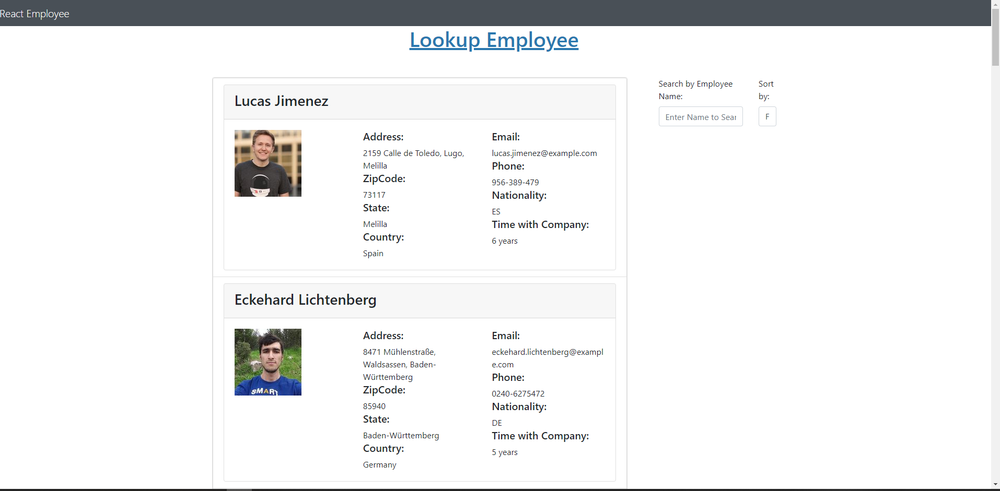

# React-Employee-Directory 
This application enables the user (company director or management) to view non sensitive information about employees of the company and gives him/her the ability to search or sort results based on firstname, lastname, city, years with the company. It also displays an image of each employee for easy identification.
[live Site here]()

[Repository Link](https://github.com/Terd47/React-Employee-Directory) 

## Technologies used
- React
- Axios
- Free Random User API
- JavaScript
- CSS
- HTML
- BootStrap
- jQuery
- Node.js

